<!-- PROJECT LOGO -->
<br />
<div align="center">
  <a href="https://scikit-learn.org/stable/">
    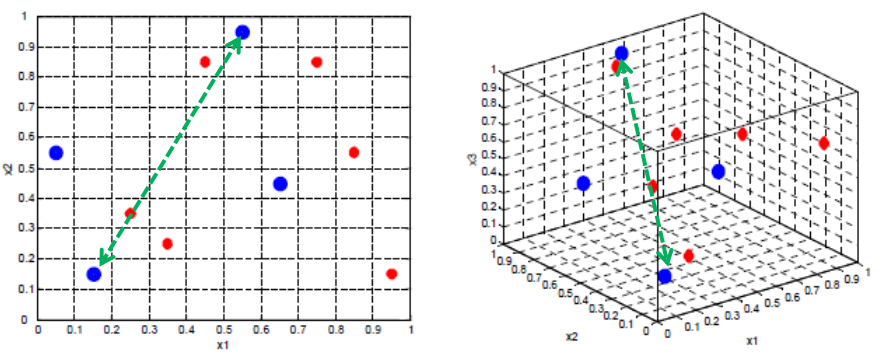
  </a>

  <h3 align="center">Curso Alura - Machine Learning: Lidando com dados de muitas dimensões</h3>

</div>

<!-- ABOUT THE PROJECT -->
## Sobre o Curso

[arquivo geral do curso](alura_care.ipynb)

### 1. Dados com muitas dimensões

* RandomForestClassifier

conjunto de árvores de decisão. É um algoritmo muito bom para ser utilizado em processos de classificação

<div align="center">
    <div>
        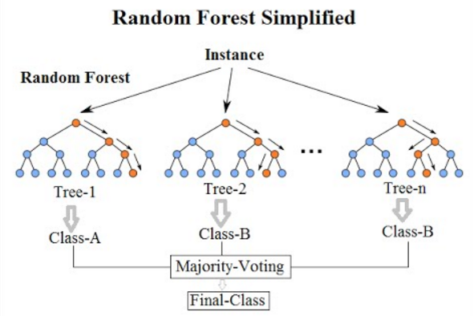
    </div>
    <div>
    <a href="https://scikit-learn.org/stable/modules/generated/sklearn.ensemble.RandomForestClassifier.html">
        Veja a DOC do RandomForestClassifier
    </a>
    </div>
</div>

   ```py
    from sklearn.ensemble import RandomForestClassifier

    classificador = RandomForestClassifier(n_estimators = 100)
    classificador.fit(treino_x, treino_y)
   ```

* Dados Faltantes

<div align="center">
    <div>
        
    </div>
    <div>
    <a href="https://pandas.pydata.org/docs/reference/api/pandas.isnull.html">
        Veja a DOC do is_null
    </a>
    </div>
</div>
   
   ```py
    resultados_exames.isnull()

    resultados_exames.isnull().sum()
   ```


### 2. Avançando e explorando dados

* Violinplot

<div align="center">
    <div>
        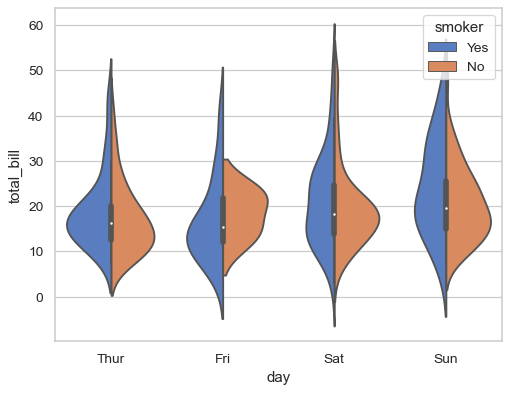
    </div>
    <div>
    <a href="https://seaborn.pydata.org/generated/seaborn.violinplot.html">
        Veja a DOC do Violinplot
    </a>
    </div>
</div>

   ```py
    from sklearn.model_selection import train_test_split

    X_train, X_test, y_train, y_test = train_test_split(X, y, test_size=0.33, random_state=42)
   ```

* Concat

<div align="center">
    <div>
        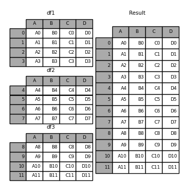
    </div>
    <div>
    <a href="https://pandas.pydata.org/docs/reference/api/pandas.concat.html">
        Veja a DOC do Concat
    </a>
    </div>
</div>

   ```py
    dados_plot = pd.concat([diagnostico, valores_exames_v1], axis = 1)
   ```

* Melt

 função melt() do Panda, que consegue pegar um dataframe e transformá-lo em uma tabela contendo as variáveis, os valores dessas variáveis e as classes pertencentes a elas.

<div align="center">
    <div>
        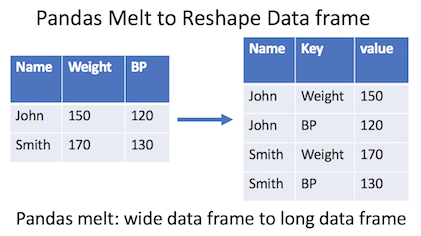
    </div>
    <div>
    <a href="https://pandas.pydata.org/docs/reference/api/pandas.melt.html">
        Veja a DOC do Melt
    </a>
    </div>
</div>

   ```py
    dados_plot = pd.melt(dados_plot, id_vars="diagnostico", 
                 var_name="exames",
                 value_name="valores")
   ```

### 3. Dados Correlacionados

* Correlação - Pandas

<div align="center">
    <div>
        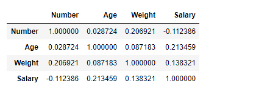
    </div>
    <div>
    <a href="https://pandas.pydata.org/docs/reference/api/pandas.DataFrame.corr.html">
        Veja a DOC do Corr
    </a>
    </div>
</div>

   ```py
    valores_exames_v3.corr() 
   ```
   
* Heatmap:

<div align="center">
    <div>
        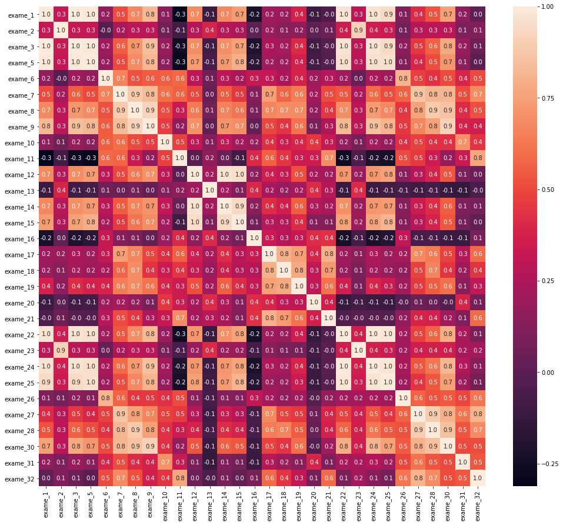
    </div>
    <div>
    <a href="https://seaborn.pydata.org/generated/seaborn.heatmap.html">
        Veja a DOC do Heatmap do Seaborn
    </a>
    </div>
</div>

   ```py
   plt.figure(figsize = (17, 15))

    sns.heatmap(matriz_correlacao, annot = True, fmt = ".1f")
   ```

### 4. Automatizando a seleção

* SelectKbest

<div align="center">
    <div>
    <a href="https://scikit-learn.org/stable/modules/generated/sklearn.feature_selection.SelectKBest.html">
        Veja a DOC do SelectKbest
    </a>
    </div>
</div>

   ```py
    from sklearn.feature_selection import SelectKBest

    selecionar_kmelhores = SelectKBest(chi2, 5)
    selecionar_kmelhores
   ```

* Função Qui²

<div align="center">
    <div>
        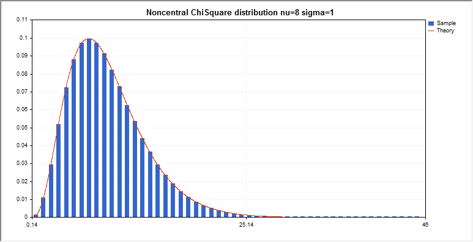
    </div>
    <div>
    <a href="https://scikit-learn.org/stable/modules/generated/sklearn.feature_selection.chi2.html">
        Veja a DOC do Qui²
    </a>
    </div>
</div>

   ```py
    from sklearn.feature_selection import chi2
   ```

* Matriz de Confusão

Uma matriz na qual os elementos i são os valores reais e os elementos j são os valores de predição

<div align="center">
    <div>
        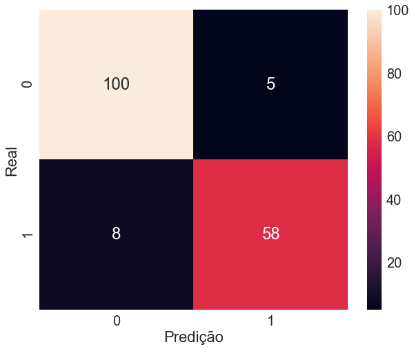
    </div>
    <div>
    <a href="https://scikit-learn.org/stable/modules/generated/sklearn.metrics.confusion_matrix.html">
        Veja a DOC do Matriz de Confusão
    </a>
    </div>
</div>

   ```py
    from sklearn.metrics import confusion_matrix

    matriz_confusao = confusion_matrix(teste_y, classificador.predict(teste_kbest))
    matriz_confusao
   ```

* RFE

<div align="center">
    <div>
    <a href="https://scikit-learn.org/stable/modules/generated/sklearn.feature_selection.RFE.html">
        Veja a DOC do RFE
    </a>
    </div>
</div>

   ```py
    from sklearn.feature_selection import RFE

    selecionador_rfe = RFE(estimator = classificador, n_features_to_select = 5, step = 1)
   ```

### 5. Visualizando os dados no plano

* RFECV

<div align="center">
    <div>
        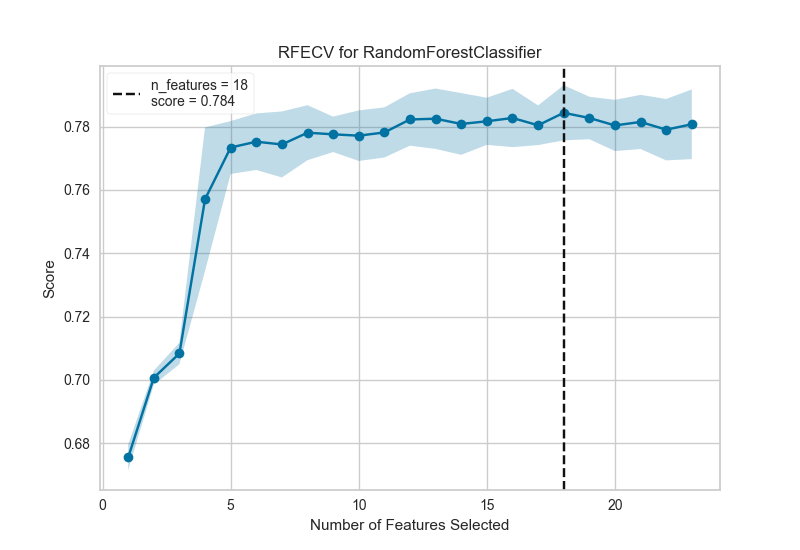
    </div>
    <div>
    <a href="https://scikit-learn.org/stable/modules/generated/sklearn.feature_selection.RFECV.html">
        Veja a DOC do RFECV
    </a>
    </div>
</div>

   ```py
    from sklearn.feature_selection import RFECV

    selecionador_rfecv = RFECV(estimator = classificador, cv = 5, scoring = "accuracy", step = 1)
    selecionador_rfecv.fit(treino_x, treino_y)

   ```


* PCA

<div align="center">
    <div>
        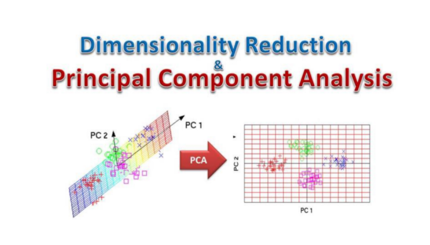
    </div>
    <div>
    <a href="https://scikit-learn.org/stable/modules/generated/sklearn.decomposition.PCA.html">
        Veja a DOC do PCA
    </a>
    </div>
</div>

   ```py
    from sklearn.decomposition import PCA

    pca = PCA(n_components = 2)
    valores_exames_v8 = pca.fit_transform(valores_exames_v6)

   ```

* TSNE

<div align="center">
    <div>
        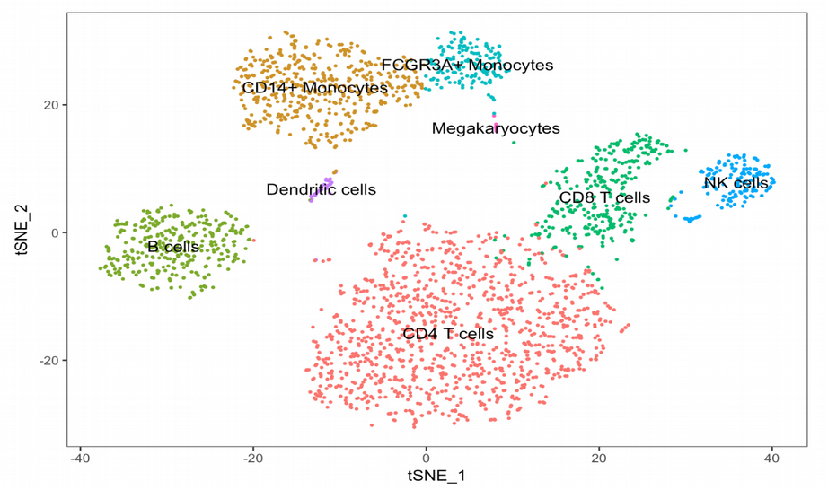
    </div>
    <div>
    <a href="https://scikit-learn.org/stable/modules/generated/sklearn.manifold.TSNE.html">
        Veja a DOC do TSNE
    </a>
    </div>
</div>

   ```py
    from sklearn.manifolds import TSNE

    tsne = TSNE(n_components = 2)
    valores_exames_v9 = tsne.fit_transform(valores_exames_v5)

   ```


